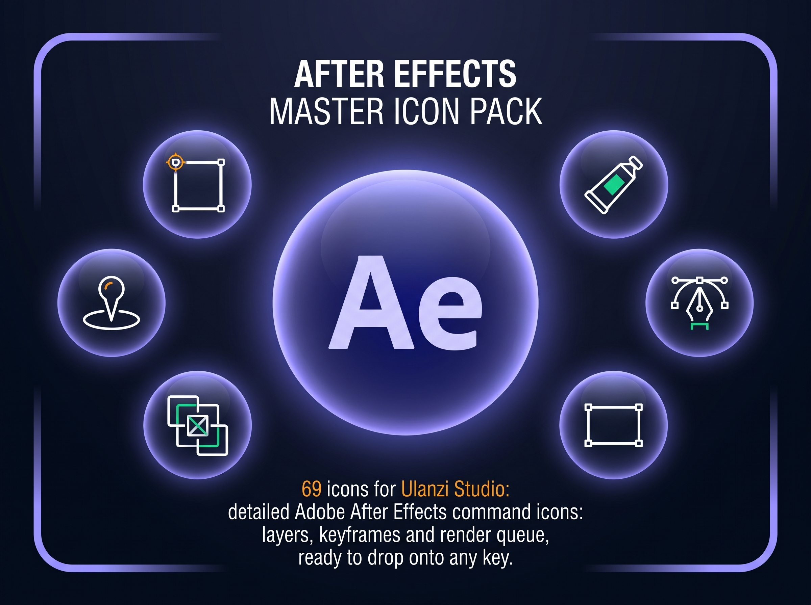

# 🎬 After Effects Master - Icon Pack for Ulanzi Studio




A detailed, command-accurate icon pack (`.png`) designed for **Ulanzi Studio** and **Ulanzi Deck** users.

Trigger Adobe After Effects' most-used commands straight from your deck: layers, keyframes, masks, the render queue and more — no more digging through menus mid-edit.

---

## ✨ Features

- 🎨 **High Quality & Optimized**
  - Crisp PNG icons tailored for Ulanzi Deck displays.

- 🎬 **After Effects-Accurate Design**
  - Icons that mirror After Effects' own menu and panel commands.

- ⚡ **Automated Installers**
  - One-click installation for:
    - **Windows** (`.bat`)
    - **macOS** (`.command`)

- 📁 **Organized Structure**
  - Automatically installs into a dedicated `After_Effects_Master` folder inside your Ulanzi Studio icon library.

---

## 📁 Repository Structure

```text
After Effects Master Icon Pack/                    (repo root)
├── After Effects Master Icon Pack/                # Icons + manifest
│   ├── Soft_Home-040-ADOBE-AFTER-EFFECTS_duplicate_ulanzi.png
│   ├── Soft_Home-040-ADOBE-AFTER-EFFECTS_add keyframe_ulanzi.png
│   ├── ...                                        # 69 icons total
│   └── manifest.json
├── instalar_icones_ulanzi.bat
├── instalar_icones_ulanzi.command
└── README.md
```
---

# 🚀 Installation

## 🖥️ Windows

1. Download or clone this repository.
2. Double-click **`instalar_icones_ulanzi.bat`** (at the repo root, next to the `After Effects Master Icon Pack` folder).
3. Restart **Ulanzi Studio**.
4. Your icons will be available under:

```
Icons → After_Effects_Master
```

---

## 🍎 macOS

1. Download or clone this repository.
2. Open **Terminal** and make the installer executable (if needed):

```bash
chmod +x instalar_icones_ulanzi.command
```

3. Double-click **`instalar_icones_ulanzi.command`** (at the repo root, next to the `After Effects Master Icon Pack` folder).
4. Restart **Ulanzi Studio**.
5. Your icons will be available under:

```
Icons → After_Effects_Master
```

---

# 🔧 Manual Installation

If you prefer to install the icons manually:

### Windows

```text
%APPDATA%\UlanziStudio\Icons\After_Effects_Master
```

### macOS

```text
~/Library/Application Support/UlanziStudio/Icons/After_Effects_Master
```

Copy everything from the inner `After Effects Master Icon Pack/` folder (all `.png` files + `manifest.json`) into the destination folder above.

---

# 🎛️ Icon List

**69 icons**, grouped by workflow:

| Group | Icons |
|---|---|
| **Layers & Objects** | 3d layer, new adjustment layer, new light layer, new null object, guide layer, shape layer, open layer, new folder |
| **Keyframes & Animation** | add keyframe, hold keyframe, easy ease, easy ease in, easy ease out, time reverse keyframes, toggle expression, exponential scale, enable time remapping |
| **Composition & Render** | new composition, new comp from selection, add comp to render queue, add to render queue, reduce project, collect files, import file, save project, save frame as |
| **Masks & Mattes** | new mask, invert mask, mask feather, track mask, separate dimentions, pan behind, puppet pin |
| **Tools** | selection, hand, pen, paint, eraser, rotate, ellipse tool, rectangle tool, clone |
| **Text** | text, convert to editable text, enable per character 3d |
| **View & Guides** | show guides, show rulers, snap to grid, snap to guides, show proportional grid, show title action safe, show all video, switches modes column, enter full screen |
| **Project & Layer Actions** | duplicate, undo, paste, sequence layers, add layer marker, add anchor point, apply last effect, apply animation preset, auto trace, lift work area, fit up to 100, go to in point of layer, reveal in finder |

---

# 💬 Community & Support

Found a bug or have an icon request?

- Open a GitHub **Issue**
- Share your setup with the Ulanzi community

---

# 📄 License

This project is released under the **MIT License**.

Feel free to use, modify, expand, and share it.

---

# ⭐ Support the Project

If you enjoy this icon pack, consider giving this repository a **⭐ Star** on GitHub.

It helps other Ulanzi users discover the project and supports future updates.
